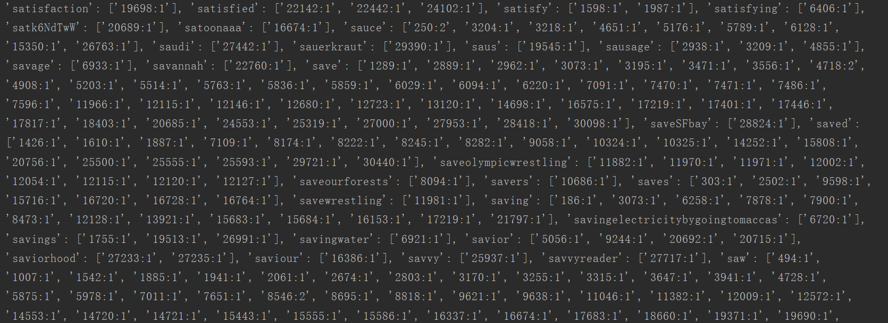
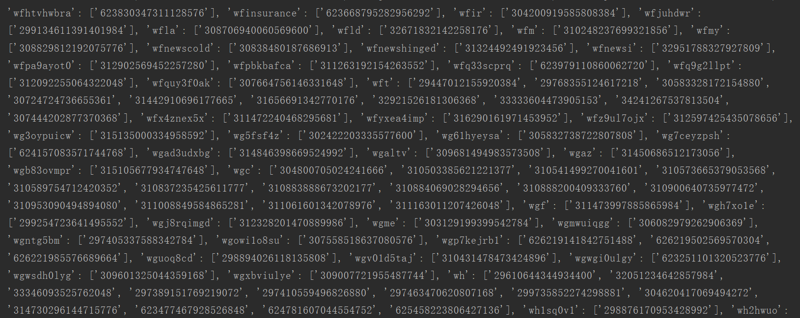
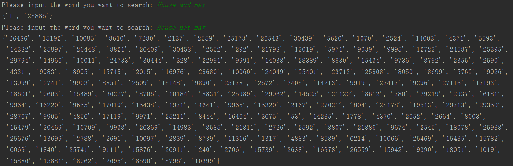
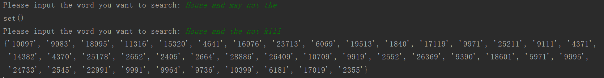
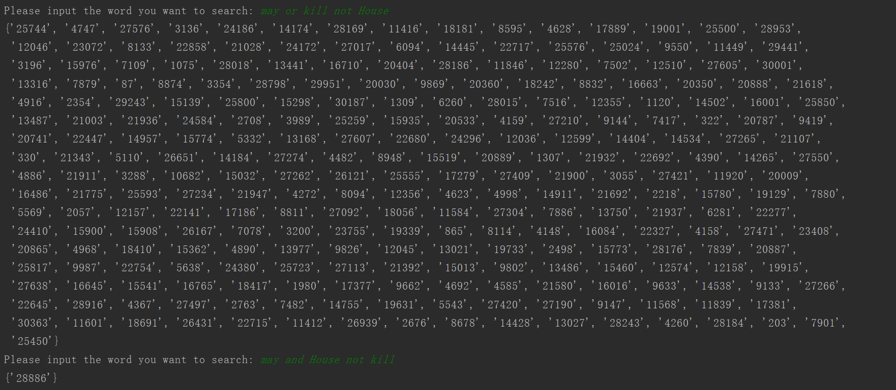
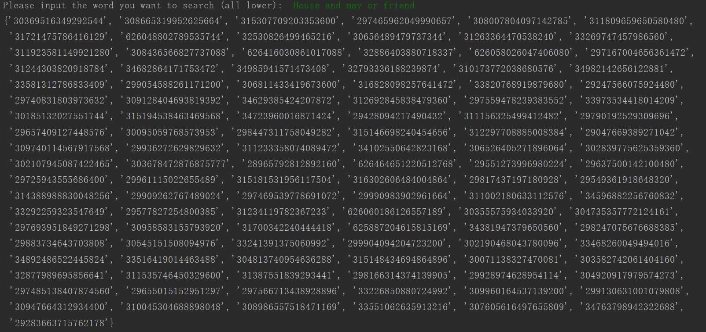

# Information Retrieval—Inverted index and Boolean Retrieval Model


## **实验内容**

1. 使用数据集30548条tweets，读取其中的text中的数据，来创建 inverted index
2. 实现 Boolean Retrieval Model：
    - Input：a query (like Ron Weasley birthday)
    - Output: print a list of top k relevant tweets.
    - 支持and, or ,not；查询优化可以选做;

## **实现思路——倒排索引**

1.读取tweets中的text中的数据,进行数据的预处理，主要是采用**正则表达式**进行分词和对一些符号进行处理，只保存得到字母和数字

```py
def token_stream(line):
    # re.I 不区分大小写
    li=nltk.word_tokenize(line)
    li=' '.join(li)
    return re.findall(r'\w+', li,re.I)  #返回一个列表
```
随后我进行了改进，加入了textblob库，实现了名词的单复数还原，动词的词性还原和分词

```py
def token_stream(line):

    li=TextBlob(line).words.singularize()
    li = ' '.join(li)  # 字符串
    terms = re.findall(r'\w+',li, re.I)
    result = []
    for word in terms:
        expected_str = Word(word)
        expected_str = expected_str.lemmatize("v")  # 将动词还原
        result.append(expected_str)
    return  result
```


2.开始匹配，mapper 即将term与相对应的text进行匹配，建立好索引 此时匹配的规则为  字典的 key为 lineNum:term, value为 [词频]

```py
def mapper(lineNum, list):
    # dic key为 lineNum:term value为 词频
    dic = {}
    for item in list:
        key = ''.join([str(lineNum), ':', item])
        if key in dic.keys():
            ll = dic.get(key)
            ll.append(1)
            dic[key] = ll
        else:
            dic[key] = [1]

    return dic

```


3.开始结合词频，combiner 因为之前的出来的词频没有求和，现在是对每行词频进行求和，得到每行对应词频

```py
# 结合 词频
def combiner(dic):
    keys = dic.keys()
    tdic = {}
    for key in keys:
       # print(key)
        valuelist = dic.get(key) #得到记录 posting list
        count = 0
        for i in valuelist:
            count += i
        tdic[key] = count
    return tdic

```


4.开始将每个term对应的posting list进行合并，reducer，将之前的 字典 key为 lineNum:term, value为 [词频]，变为 key：term，value：[lineNum:词频]

```py
#将每个 term对应的 posting进行合并
def reducer(dic):
    keys = dic.keys()
    rdic = {}
    for key in keys:
        lineNum, kk = key.split(":")
        ss = ''.join([lineNum, ':', str(dic.get(key))]) #变成字符串
        if kk in rdic.keys():
            ll = rdic[kk]
            ll.append(ss)
            rdic[kk] = ll
        else:
            rdic[kk] = [ss]

    return rdic
```


5.进行排序，按term的首字母大小进行排序，从而建立起倒排索引

```py
#排序，返回一个列表
def shuffle(dic):
    dict = sorted(dic.items(), key=lambda x: x[0])
    return dict

```

结果图： 

每个词对应了 它出现的文档（此时用行号作为文档）和在该文档下的词频


用 tweetid 作为 文档id，并且把词频给去掉，实现标准输出




## **实现思路——布尔查询**

1.要求能支持 and，or，not操作，现在已经能得到倒排索引

2.先得到输入的字符串，变成列表进行遍历，判断是否存在 and，or，not的词语

3.将结果 answer_set变成集合，分别对 and or not 操作进行处理

4.and即对应集合的交集 即 intersection函数，or即对应 集合的并集 即 union函数，not即对应集合的差集difference函数，通过这三个函数来实现布尔查询

and  和 not 单独操作




and  和 not 同时操作





and  or 和 not 同时操作



## **改进**

1. 增加了优先级操作，可以支持 A B C 三个单词之间的 and or not 的优先级操作，优先级关系为 not >  and > or



2. 学习和实用了 textblob库，实用了 其中 words方法就进行分词，还有对名词的单复数处理，对动词进行词性还原，学习实用的方法图片如下图所示：


3. 加入了统计词频（tf）和统计词的文档（df），便于实验2计算 文档和查询的分数