# Information Retrieval-Clustering with sklearn

## **实验内容**
1. 读入数据集：
<br>
-sklearn.datasets.load_digits
<br>
-sklearn.datasets.fetch_20newsgroups

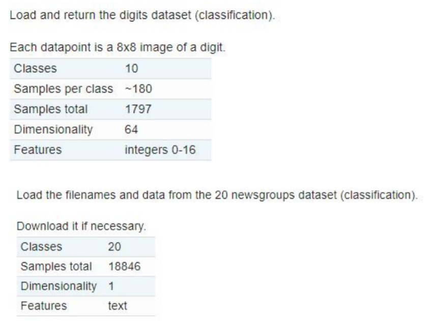
2. 学习经典聚类方法，网址为：<br>
https://scikit-learn.org/stable/modules/clustering.html#

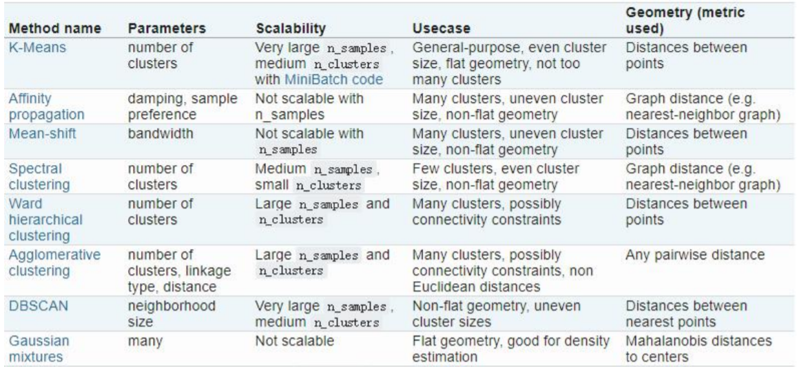

3. 使用经典的聚类方法来对两个数据集进行聚类，使用下面的评价方法进行评价

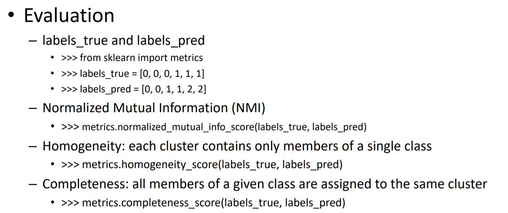


## **实验步骤**

一、对 sklearn.datasets.load_digits 手写识别数据集进行处理
得到 一个 1797*64维度的矩阵，一共1797个64像素的图片，然后需要对矩阵进行标准化处理，使用scale函数，即：(X- 均值) / 标准差，数据一共十个类别，分别是数字 0-9 ，一共十个数字，然后进行处理，准备聚成10类，评价函数为下图：

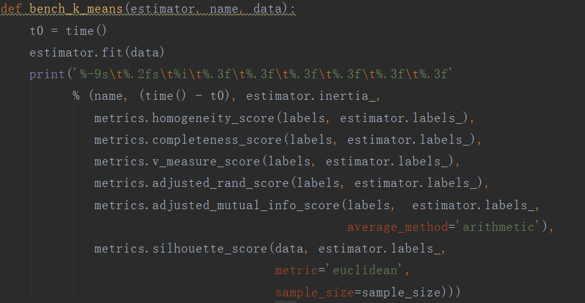

<br>

二、 使用 聚类函数：
1. K-Means 聚类 <br>
bench_k_means(KMeans(init='k-means++', n_clusters=n_digits, n_init=10),name="k-means++", data=data)

2. 相似性传播 <br>
af = AffinityPropagation().fit(data)
bench_show(AffinityPropagation(),name="AffinityPropagation", data=data)

3. 均值漂移 <br>
bandwidth = estimate_bandwidth(data,quantile=0.2,n_samples=500)
bench_show(MeanShift(bandwidth=bandwidth,bin_seeding=True),
              name="MeanShift", data=data)
4. 光谱聚类 <br>
使用PCA数据降维 <br>
pca=PCA(n_components=n_digits).fit_transform(data)
bench_show3(SpectralClustering(n_digits),name="SpectralClustering", data=pca)

5. 分层聚类<br>
ward = AgglomerativeClustering(n_clusters=n_digits, linkage='ward')
ward.fit(data)<br>
bench_show( AgglomerativeClustering(n_clusters=n_digits, linkage='ward'),
              name="AgglomerativeClustering", data=data)
6. 基于密度的聚类<br>
db = DBSCAN().fit(data)<br>
bench_show3(DBSCAN(),name="DBSCAN", data=data)


7. 光学聚类<br>
clust = OPTICS(min_samples=50, xi=.05, min_cluster_size=.05)<br>
bench_show(OPTICS(min_samples=50, xi=.05, min_cluster_size=.05),name="OPTICS", data=data)

8. 高斯混合模型<br>
gmm = mixture.GaussianMixture(n_components=n_digits, covariance_type='full').fit(data) <br>
bench_show2(mixture.GaussianMixture(n_components=n_digits, covariance_type='full'),name="Gaussian", data=data)

9. Birch <br>
brc = Birch(branching_factor=50, n_clusters=n_digits, threshold=0.5, compute_labels=True)<br>
brc.fit(data)<br>
bench_show2(Birch(branching_factor=50, n_clusters=n_digits, threshold=0.5, compute_labels=True),name="Birch", data=data)

三、 运行，结果如下：


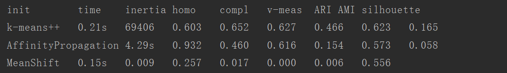 
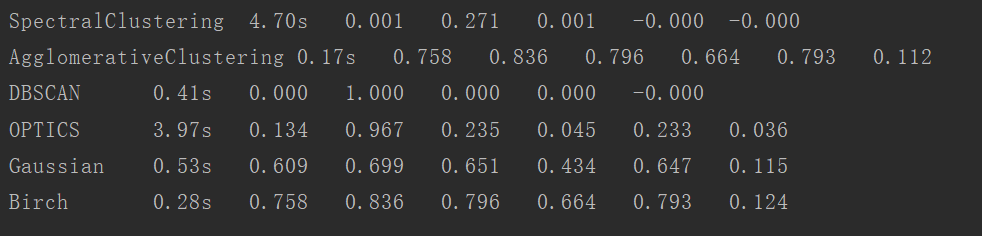

四、对 sklearn.datasets.fetch_20newsgroups 进行处理，一共有20类新闻数据

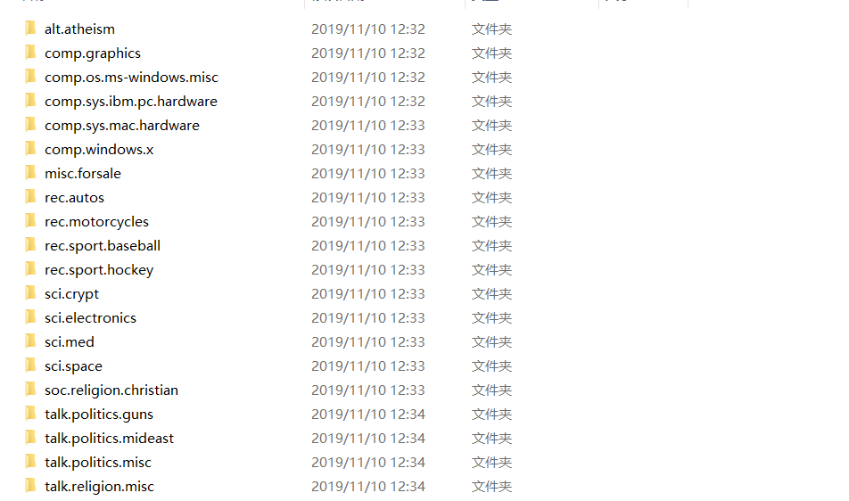

categories = ['alt.atheism', 'talk.religion.misc','comp.graphics',
'sci.space'],从20个类别中，提取4个类别的数据（包括训练集和测试集），进行处理，我们可以选择  HashingVectorizer 和 TfidfVectorizer 两种方式对文本进行 向量化，这里我选择使用  TfidfVectorizer，这样就可以得到了 X矩阵 n_samples: 3387, n_features: 10000

五、使用 降维函数，进行降维 TruncatedSVD

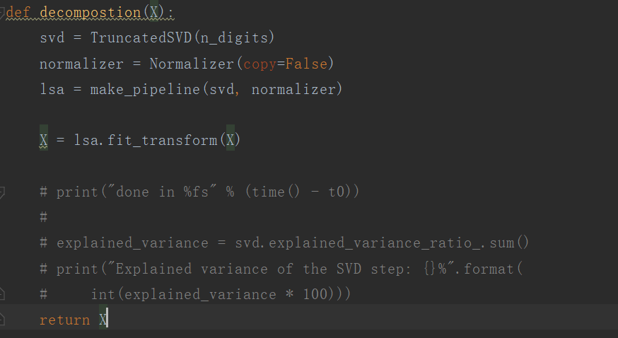

使用 评价函数

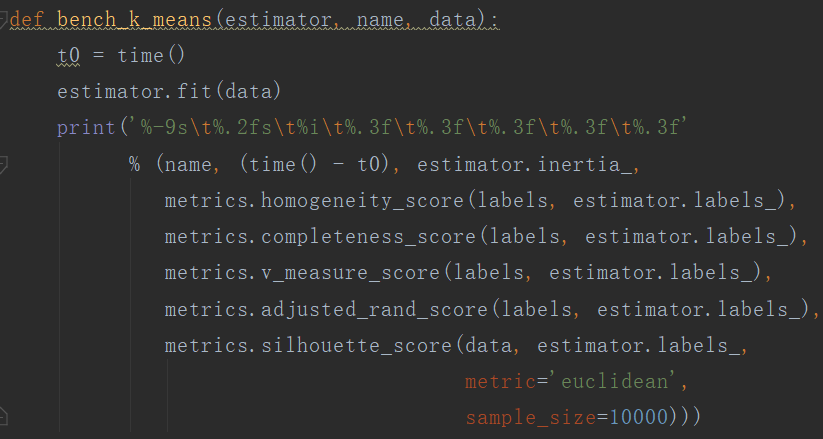

六、使用聚类函数：
1. K-Means 聚类 <br>
km=MiniBatchKMeans(n_clusters=true_k, init='k-means++', n_init=1,
                          init_size=1000, batch_size=1000, verbose=opts.verbose)
bench_k_means(km,name="k-means++", data=X)

2. 相似性传播 <br>
数据没有降维<br>
bench_show(AffinityPropagation(),name="AffinityPropagation",data=X)

3. 均值漂移 <br>
bandwidth = estimate_bandwidth(decompostion(X), quantile=0.2, n_samples=500)<br>
bench_show(MeanShift(bandwidth=bandwidth,bin_seeding=True),
              name="MeanShift", data=decompostion(X))
4. 光谱聚类 <br>
bench_show3(SpectralClustering(n_digits),
              name="MeanShift", data=decompostion(X))

5. 分层聚类<br>
bench_show(AgglomerativeClustering(n_clusters=n_digits, linkage='ward'),name="AgglomerativeClustering", data=decompostion(X))
6. 基于密度的聚类<br>
bench_show3(DBSCAN(),name="DBSCAN",data=X)


7. 光学聚类<br>
bench_show(OPTICS(),name="OPTICS", data=decompostion(X))

8. 高斯混合模型<br>
bench_show2(mixture.GaussianMixture(n_components=n_digits, covariance_type='full'),name="Gaussian", data=decompostion(X))

9. Birch <br>
bench_show2(Birch(branching_factor=50, n_clusters=n_digits, threshold=0.5, compute_labels=True),name="Birch", data=decompostion(X))<br>

七、 K-means 输出质心函数,输出聚类中心的文本

```py
if not opts.use_hashing:
    print("Top terms per cluster:")

    if opts.n_components:
        original_space_centroids = svd.inverse_transform(km.cluster_centers_)
        order_centroids = original_space_centroids.argsort()[:, ::-1]
    else:
        order_centroids = km.cluster_centers_.argsort()[:, ::-1]

    terms = vectorizer.get_feature_names()
    for i in range(true_k):
        print("Cluster %d:" % i, end='')
        for ind in order_centroids[i, :10]:
            print(' %s' % terms[ind], end='')
        print()
```

八、 输出结果<br>

聚类结果：
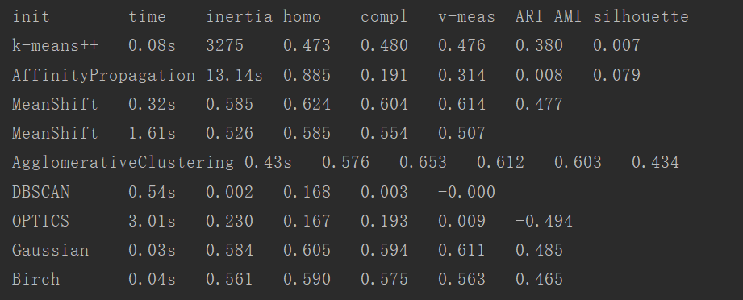


K-means的 质心文章：
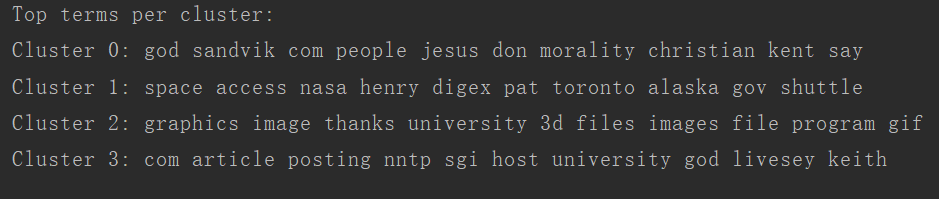


